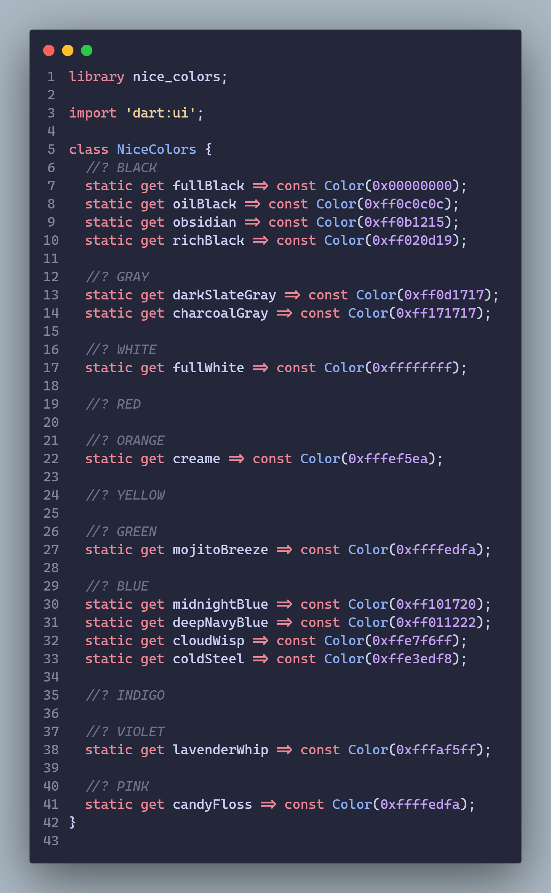

## Features

```
Introducing NiceColors package - your go-to solution for adding a touch of elegance to your Flutter projects! This lightweight package features the delightful NiceColors class, a curated collection of aesthetically pleasing colors that will instantly elevate the visual appeal of your app.
```

## Getting started

```
In your flutter project add the dependency:
```

```yaml
dependencies:
  nice_colors: any
```

Import the package:

```dart
import 'package:nice_colors/nice_colors.dart';
```

## Usage

```dart
const like = 'sample';
```

## Codebase


## Additional information

For better understanding, refer to the [example project](https://github.com/MatejaDjokic/nice-colors) in the official git repo.
